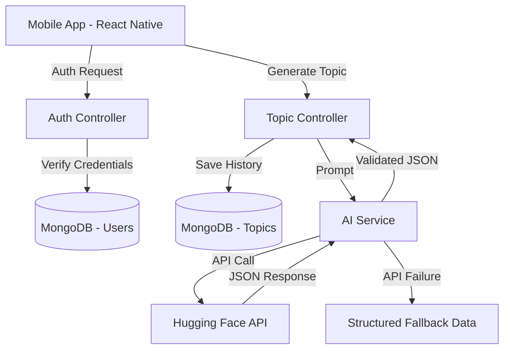

# AI StudyMate  
### AI-Powered Personalized Learning Companion

AI StudyMate is a full-stack mobile application that transforms any topic into an interactive learning experience. It leverages Hugging Face LLMs for real-time content generation and a scalable Node.js backend architecture.

---

## 🚀 Features

- 🤖 **AI Content Generation** – Generates structured explanations and 5-question quizzes using Hugging Face LLMs.
- 📚 **Adaptive Learning** – Supports Beginner, Intermediate, and Advanced difficulty levels.
- 🛡 **Secure Authentication** – JWT-based authentication with password hashing (Bcrypt).
- 📱 **Offline Fallback Mode** – Automatically switches to structured mock data if AI API fails.
- 📊 **Progress Tracking** – Stores quiz history and scores for performance monitoring.
- 🔁 **Robust Error Handling** – Retries, safe JSON parsing, and sanitized responses.

---

## 🛠 Tech Stack

### Backend
- Runtime: Node.js  
- Framework: Express.js  
- Database: MongoDB (Mongoose)  
- Authentication: JWT + Bcrypt  
- AI Engine: Hugging Face Inference API (Zephyr-7B-Beta + fallback model)

### Frontend
- Framework: React Native (Expo)  
- Language: TypeScript  
- Navigation: Expo Router  
- HTTP Client: Native Fetch API  

---

## 🏗 Architecture



---

## 📦 Installation

### Prerequisites

- Node.js (v18+)
- MongoDB Atlas URI
- Hugging Face API Token (Free)

---

### 1️⃣ Backend Setup

```bash
cd backend-node
npm install
cp .env.example .env
```

Edit `.env`:

```
PORT=5000
MONGO_URL=your_mongodb_uri
JWT_SECRET=your_secret
HF_API_KEY=your_huggingface_key
```

Start backend:

```bash
npm run dev
```

---

### 2️⃣ Frontend Setup

```bash
cd frontend
npm install
cp .env.example .env
```

Edit `.env`:

```
EXPO_PUBLIC_BACKEND_URL=http://YOUR_LOCAL_IP:5000
```

Start Expo:

```bash
npx expo start -c
```

---

## 📱 Android Build (Optional)

To generate a standalone APK:

```bash
cd frontend
npm install -g eas-cli
eas build -p android --profile preview
```

---

## 🔒 Security

- No hardcoded API keys
- Environment-based configuration
- Password hashing with Bcrypt
- JWT-based authentication
- Strict JSON validation for AI responses
- Graceful fallback handling

---

## 🧠 AI Reliability Features

- Strict JSON enforcement prompt
- Safe substring JSON extraction
- Retry mechanism with exponential backoff
- Automatic fallback mode if:
  - API key missing
  - Rate limit reached
  - Model unavailable (410/429/503)

---

## 📄 License

This project is licensed under the MIT License.
